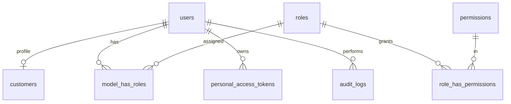
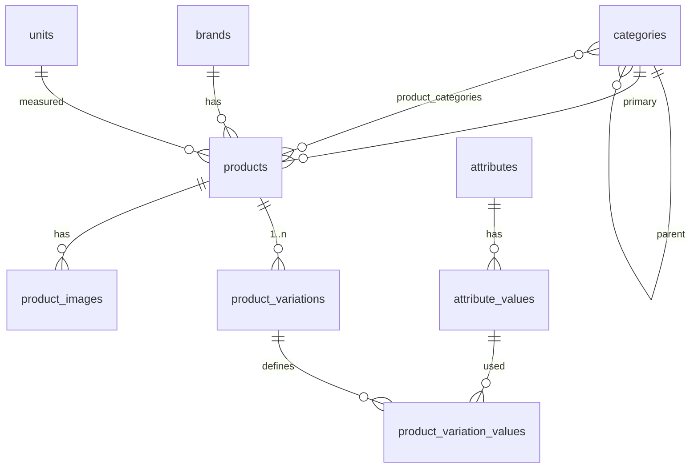
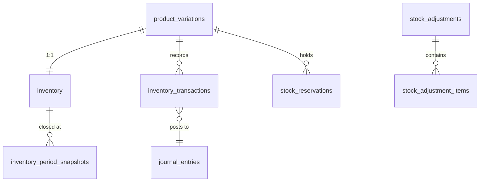
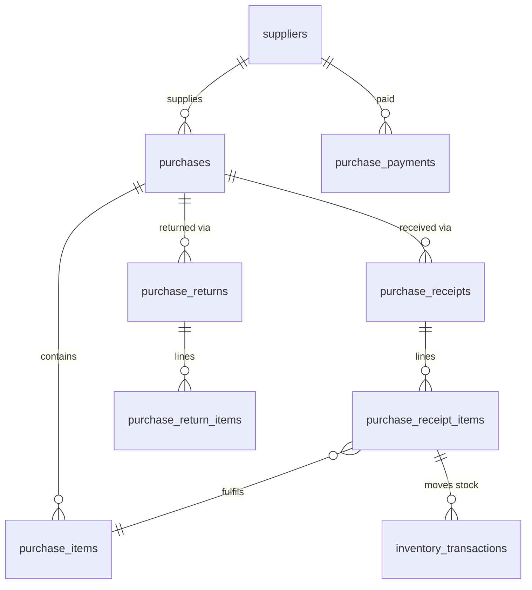
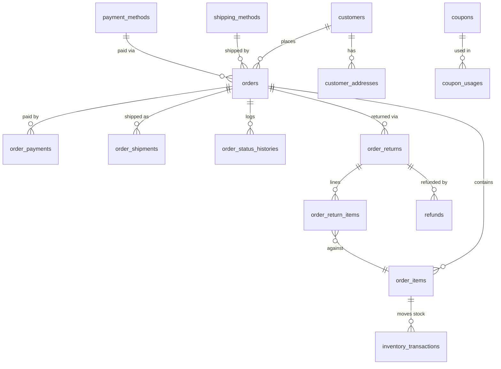
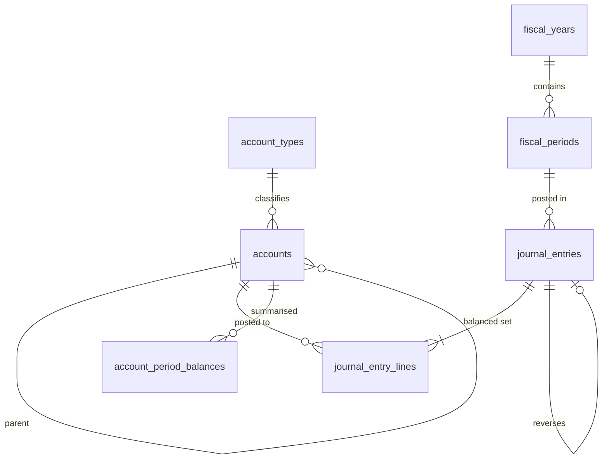

# Upokoron — Single-Vendor eCommerce & ERP
## Phase 1: Architecture, Data Model, and Roadmap

**Stack:** React 19 + Vite + Tailwind v4 + Zustand + TanStack Query · Laravel 12 + Sanctum + Eloquent · MySQL 8 · cPanel shared hosting
**Currency:** BDT (৳) · **Timezone:** Asia/Dhaka · **Status:** design only — no code ships in this phase

---

## 0. Scope

**In scope.** One store, one owner, one inventory. Customers buy from a public storefront; the owner and staff run everything else from an admin panel: catalog, purchasing, stock, orders, returns, money, and reports. The accounting is real double-entry, not a summary table.

**Explicitly not built.** No vendors or sellers. No outlets, warehouses, locations, or stock transfers. No POS. No `outlet_id`, `warehouse_id`, or `location_id` columns anywhere in the schema. No multi-currency. No Redis requirement. No Node process in production.

**One thing worth naming up front:** "Goods in Transit" appears later in this document as an *account*, not a location. It tracks the value of stock that has physically left the building but has not yet been delivered. It does not violate the single-inventory rule — there is still exactly one stock ledger.

---

## 1. Critical design review

You asked me to find the problems before writing code. These are the eighteen places where systems like this actually break. Each one has a decision attached, and every later section of this document is consistent with these decisions.

### Inventory valuation and COGS

**1. Moving average dies on out-of-order posting.** If a purchase dated last Tuesday is entered today, after sales have already consumed stock at the old average, the average was wrong for every sale in between. Recomputing history retroactively means restating already-published profit.

> **Decision.** Cost is computed at *posting time*, never at document date. History is never recomputed. Fiscal periods can be closed, and nothing can post into a closed period. Backdating within an open period is allowed but is recorded with both `transacted_at` and `created_at` so the divergence is visible.

**2. Negative stock breaks the arithmetic.** Average cost is `value ÷ quantity`. At zero quantity that is a division by zero; below zero it is meaningless, and any COGS derived from it is garbage that silently flows into the P&L.

> **Decision.** Negative stock is impossible for stock-tracked items. Enforced at three layers: a `SELECT … FOR UPDATE` check in `InventoryService`, a MySQL `CHECK (quantity >= 0)` constraint, and an integrity command that fails loudly if either is ever bypassed.

**3. Rounding drift separates the stock ledger from the general ledger.** Three units bought for ৳10.00 total cost ৳3.333… each. Sell them one at a time at 2 decimal places and you have removed ৳9.99 of value from an item worth ৳10.00. Do that ten thousand times and the Inventory account no longer matches the inventory valuation report.

> **Decision.** `quantity` and `stock_value` are the two authoritative numbers. `average_cost` is derived (`stock_value ÷ quantity`), stored at 6 decimals only for display and reporting. `stock_value` is `DECIMAL(15,2)` — the *same precision as the GL* — so the two can be compared for exact equality. Two rules make it exact:
> - When an outbound movement empties the stock, COGS is the entire remaining `stock_value`, not `qty × average_cost`.
> - If quantity ever reaches zero with a non-zero residual value, the residue posts to **5300 Inventory Adjustment (Rounding)** and `stock_value` is forced to zero.

**4. Two concurrent sales can both read a stale average cost.** Without locking, both compute COGS from the same pre-sale value, and the second one writes over the first one's update. Stock and value both end up wrong, and nothing in the UI ever shows it.

> **Decision.** Every quantity or value mutation goes through `InventoryService`, which takes a row lock on the `inventory` row first. When an operation touches several variations, rows are locked in ascending `product_variation_id` order — a fixed order is what prevents two concurrent multi-line orders from deadlocking each other.

**5. Sales returns must not come back at today's cost.** If an item was sold when the average was ৳100 and is returned when the average is ৳130, restocking at ৳130 invents ৳30 of profit out of nothing — and does it in the direction that flatters the numbers.

> **Decision.** Every `order_items` row permanently stores `unit_cost` and `cogs_total` at the moment of sale. A return restocks at that exact stored unit cost and reverses exactly that COGS. This is the single most important rule in the system: **the COGS of a sale is written once and never recalculated.**

**6. Purchase returns have the same problem in reverse.** Returning goods to a supplier at the current average, rather than at what those goods cost when received, leaks value into or out of the Inventory account.

> **Decision.** Purchase returns are made against a specific receipt line and use that line's `unit_cost`. If on-hand quantity is lower than the return quantity, the return is blocked.

**7. Freight invoices arrive after the goods.** Real landed cost is not known at receipt, but inventory has already been valued and some units may already be sold.

> **Decision.** Freight, duty, and other charges entered *on the purchase* are allocated into `unit_cost` at receipt time (by value or by quantity — selectable per purchase). Charges discovered later go through a **Purchase Cost Adjustment** document, which revalues only the units still on hand and expenses the already-sold portion straight to COGS. This is deferred to Phase 12; the `landed_cost_allocated` column exists from Phase 5 so no migration is needed later.

### Revenue, returns, and the COD problem

**8. Recognizing revenue at order confirmation is wrong here, and badly so.** Cash-on-delivery is dominant in Bangladesh and return-to-origin rates are high. Counting a confirmed order as revenue means every RTO becomes a reversal, and your sales figures overstate reality by the entire failed-delivery rate.

> **Decision.** Three separate moments, deliberately decoupled:
> - **Order placed** — stock is *reserved*. No inventory movement, no journal entry.
> - **Shipped** — stock physically leaves: `Dr Goods in Transit / Cr Inventory`. Still no revenue, still no COGS.
> - **Delivered** — revenue and COGS recognized together: `Dr COGS / Cr Goods in Transit`, plus the receivable and revenue entry.
>
> An RTO is then a clean one-line reversal — `Dr Inventory / Cr Goods in Transit` — with no revenue to unwind, because none was ever recognized. The recognition point is a setting (`shipped` or `delivered`) defaulting to **delivered**.

**9. COD cash is not your cash until the courier remits it.** Treating a delivered COD order as cash received overstates the cash balance by everything currently sitting with the courier, and hides courier fees entirely.

> **Decision.** A dedicated **1145 COD Receivable (Courier)** account. Delivery moves the balance from customer AR to courier receivable. Remittance clears it: `Dr Bank`, `Dr Delivery Expense` (the courier's fee), `Cr COD Receivable`. The gap between the two is a real, reportable number.

**10. Order-level discounts make partial returns unanswerable.** A ৳500 coupon on a three-item order, one item returned — how much do you refund? Any answer computed at return time is a guess, and different parts of the system will guess differently.

> **Decision.** At order creation, *every* order-level amount — coupon, manual discount, shipping, reward redemption — is allocated down to the line items proportionally by line value and stored on `order_items`. A line's `net_amount` is then a fact, and a refund is simply that line's net amount times the returned proportion. Allocation remainders (from rounding) are added to the largest line so the allocated amounts always sum exactly to the order total.

**11. Returns have knock-on effects that are easy to forget.** Reward points earned on the returned value must be clawed back. Affiliate commission must be reversed. Coupon usage may or may not be released.

> **Decision.** A return is a single service call that fans out to reward reversal, commission reversal, inventory restock, and the refund journal entry, all inside one database transaction. Coupon usage is released only on full cancellation, not on partial return (configurable).

### Accounting integrity

**12. A retried webhook double-posts the ledger.** Payment gateways retry. A background job retries. Anything that posts a journal entry from an external trigger will eventually fire twice, and a duplicated entry is very hard to spot later because it is still perfectly balanced.

> **Decision.** `journal_entries` carries `UNIQUE (reference_type, reference_id, event)`. Posting the same business event for the same document twice is rejected by the database, not by application logic. All gateway callbacks additionally key on a unique `transaction_id`.

**13. Unbalanced entries must be structurally impossible.** An assertion in one service is not enough when six modules post entries.

> **Decision.** `JournalEntry` and `JournalEntryLine` are `guarded` against mass creation and may only be written by `JournalService::post()`, which validates that debits equal credits before the transaction commits. A feature test asserts no other class references those models' write methods. A nightly `integrity:check` command re-verifies the whole ledger.

**14. Posted financial records must be immutable.** Editing a posted entry destroys the audit trail and silently changes closed reports.

> **Decision.** No `deleted_at` column exists on `journal_entries`, `journal_entry_lines`, or `inventory_transactions` — they cannot be soft-deleted because there is nothing to delete with. Corrections are reversing entries that reference the original via `reversal_of_entry_id`. Documents get `cancelled` / `reversed` statuses; rows are never removed.

**15. Subledgers drift from control accounts.** The sum of customer balances stops matching the Accounts Receivable account, usually because one code path wrote to the customer record without a journal line.

> **Decision.** There is no separate customer or supplier ledger table. Customer and supplier ledgers are *derived* from `journal_entry_lines` filtered by `party_type` / `party_id`. Drift is impossible because there is only one source of truth. Denormalized balances on `customers` / `suppliers` are caches, rebuilt by a command.

### Ordering, stock reservation, and trust

**16. Abandoned checkouts poison inventory.** A reservation counter with no expiry means every abandoned cart permanently removes sellable stock.

> **Decision.** A real `stock_reservations` table with `expires_at`, not just a counter. The counter on `inventory.reserved_quantity` is a cache; the table is the truth, and a scheduled command both releases expired reservations and reconciles the counter against the table. Unpaid online orders hold stock for 30 minutes (configurable); COD orders reserve immediately on placement.

**17. The gap between "added to cart" and "order placed" is where overselling happens.** Stock checked at cart time is meaningless by checkout time.

> **Decision.** Stock is validated *again* inside the order-creation transaction, after the row lock, and the order fails if it cannot be satisfied. `available_quantity` is a MySQL generated stored column (`quantity - reserved_quantity`) so it can be indexed and can never disagree with its inputs.

**18. Never trust a price from the browser.** The frontend sends product IDs, quantities, an address, a shipping method, and a coupon code. It does not send prices, discounts, shipping cost, or totals — and if it does, they are discarded.

> **Decision.** `PricingService` recomputes every number server-side from the database: unit prices from `product_variations`, coupon validity and value from `coupons` and its restriction pivots, shipping from the method and the address zone, reward redemption against the customer's actual balance. The order total is a server output, not a client input.

### Two smaller things that matter

**Document numbers.** `MAX(id) + 1` produces duplicates under concurrency. A `document_sequences` table with a row lock per key produces safe, gapless, per-year-resettable numbers: `ORD-2026-000141`, `PUR-2026-00023`.

**Order status is really three statuses.** Your list mixes lifecycle (Pending → Delivered) with settlement (Refunded, Partially Refunded). Keeping them in one column means a partially refunded order that is still being delivered has no representable state.

> **Decision.** Three orthogonal columns — `status` (lifecycle), `payment_status`, `return_status` — plus a single derived `display_status` that produces exactly the ten labels you listed. You get the vocabulary you asked for; the machine gets states it can reason about.

---

## 2. System architecture

```
                    ┌──────────────────────────────────────┐
                    │  Browser — one Vite SPA, two trees   │
                    │  /        storefront (eager)         │
                    │  /admin   dashboard (lazy chunk)     │
                    └───────────────┬──────────────────────┘
                                    │  same origin, HttpOnly cookie session
                                    ▼
                    ┌──────────────────────────────────────┐
                    │  Laravel REST API  /api/v1           │
                    │  Controllers → FormRequests →        │
                    │  Services (all business rules)       │
                    │  → Eloquent → MySQL                  │
                    └───────────────┬──────────────────────┘
                                    ▼
            ┌───────────────────────────────────────────────┐
            │ MySQL 8 · InnoDB · utf8mb4 · row-locked writes │
            └───────────────────────────────────────────────┘

  cron ─┬─ schedule:run (every minute)
        └─ queue:work --stop-when-empty  (no daemon needed on cPanel)
```

**Authentication: Sanctum in SPA cookie mode, not token mode.** Because we control the cPanel layout, the React build is served from `example.com` and the API from `example.com/api` — the same origin. That gives HttpOnly, `SameSite=Lax` session cookies with CSRF protection, and means no access token is ever exposed to JavaScript or to an XSS payload. Token mode stays available on the same endpoints for a future mobile app.

**All business logic lives in services, never in controllers or models.** Controllers validate and delegate; models describe relationships and scopes. This is the rule that makes the invariants in §5 enforceable, because there is exactly one code path to audit for each of them.

**Redis is optional.** Cache driver `database`, queue driver `database`, sessions in the database. If a host offers Redis, changing two `.env` lines picks it up with no code change.

---

## 3. Module list

| # | Module | Depends on | Phase |
|---|---|---|---|
| 1 | Users, roles, permissions | — | 2 |
| 2 | Settings, document sequences, audit log | 1 | 2 |
| 3 | Chart of accounts, journal engine, fiscal periods | 2 | 3 |
| 4 | Categories, brands, attributes, units | 2 | 4 |
| 5 | Products, variations, images, SEO | 4 | 4 |
| 6 | Inventory, transactions, costing, valuation | 3, 5 | 5 |
| 7 | Suppliers | 3 | 6 |
| 8 | Purchases, receipts, returns, payments | 6, 7 | 6 |
| 9 | Customers, addresses, groups | 2 | 7 |
| 10 | Storefront catalog, cart, pricing | 5, 6 | 7 |
| 11 | Shipping methods and zones | 2 | 7 |
| 12 | Payment methods and gateways | 3 | 8 |
| 13 | Checkout, orders, reservations, fulfilment | 6, 9–12 | 8 |
| 14 | Returns, refunds, RTO handling | 13 | 9 |
| 15 | Coupons and discount campaigns | 13 | 9 |
| 16 | Reward points | 13 | 10 |
| 17 | Affiliate system | 13 | 10 |
| 18 | Expenses and income | 3 | 11 |
| 19 | Reports — 21 of them | all | 11 |
| 20 | Admin dashboard | 19 | 11 |
| 21 | Notifications (mail, SMS, in-app) | 13 | 12 |
| 22 | SEO, sitemap, structured data, redirects | 5, 10 | 12 |
| 23 | Landed cost adjustments, period close | 6, 3 | 12 |

---

## 4. Data model

Conventions applied to every table: `InnoDB`, `utf8mb4_unicode_ci`, money `DECIMAL(15,2)`, quantity `DECIMAL(15,3)`, unit and average cost `DECIMAL(15,6)`, timestamps stored UTC, foreign keys `RESTRICT` on delete unless stated. Catalog and party tables use `deleted_at`; financial and inventory tables never do.

### 4.1 Identity and access



One `users` table for everyone. Staff and customers authenticate identically; roles decide what the token or session may reach, and a customer record is a 1:1 profile hanging off a user. A staff member can therefore also shop without a duplicate account. Admin access is gated by the `admin.access` permission, not by a user type flag.

Uses **spatie/laravel-permission** — mature, cPanel-friendly, no extra services.

| `users` | |
|---|---|
| `id` `name` `email` UQ `phone` UQ null `password` `avatar` | |
| `is_active` `email_verified_at` `phone_verified_at` `last_login_at` `last_login_ip` | |
| `timestamps` `deleted_at` | |

| `audit_logs` | |
|---|---|
| `id` `user_id` null `event` `auditable_type` `auditable_id` | `event`: created/updated/deleted/status_changed/login |
| `old_values` JSON `new_values` JSON `url` `ip` `user_agent` `tags` `created_at` | index (`auditable_type`,`auditable_id`), (`user_id`,`created_at`) |

### 4.2 Catalog



**Every product has at least one variation row.** A simple product gets one default variation created automatically. This is worth the small storage cost: inventory, order items, purchase items, and every report then have exactly *one* code path instead of a branch on `has_variations` in twenty places.

| `products` | notes |
|---|---|
| `id` `name` `slug` UQ `brand_id` null `category_id` `unit_id` | |
| `type` ENUM(simple, variable) `has_variations` BOOL | |
| `short_description` `description` LONGTEXT | |
| `is_stock_tracked` BOOL default 1 | services / digital goods set 0 |
| `status` ENUM(draft, active, archived) `is_featured` `published_at` | |
| `weight` DECIMAL(10,3) `length` `width` `height` | shipping calculation |
| `meta_title` `meta_description` `meta_keywords` `og_image` `canonical_url` | |
| `view_count` `sold_count` `rating_avg` `rating_count` | denormalized caches |
| `created_by` `timestamps` `deleted_at` | index (`status`,`published_at`), (`category_id`,`status`) |

| `product_variations` | notes |
|---|---|
| `id` `product_id` `sku` UQ `barcode` UQ null `name` | |
| `selling_price` `compare_at_price` null | |
| `special_price` null `special_starts_at` `special_ends_at` | scheduled simple sale |
| `last_purchase_price` DECIMAL(15,6) null | display only — never used for COGS |
| `weight` `image_id` null `is_default` `is_active` `position` | |
| `timestamps` `deleted_at` | index (`product_id`,`is_active`) |

Cost never appears on this table. Cost lives in `inventory` and in the immutable snapshots on `order_items` / `purchase_items`. Keeping it off the variation removes the temptation to compute historical profit from a current price.

### 4.3 Inventory — the core



| `inventory` | notes |
|---|---|
| `id` `product_variation_id` UQ | one row per variation, created with the variation |
| `quantity` DECIMAL(15,3) | `CHECK (quantity >= 0)` |
| `reserved_quantity` DECIMAL(15,3) | `CHECK (reserved_quantity >= 0)`, cache of `stock_reservations` |
| `available_quantity` | **generated stored** = `quantity - reserved_quantity`, indexed |
| `stock_value` DECIMAL(15,2) | authoritative; equals this item's share of GL account 1150 |
| `average_cost` DECIMAL(15,6) | **derived** = `stock_value / quantity`, stored for reporting only |
| `min_stock` `reorder_level` `max_stock` DECIMAL(15,3) | |
| `last_purchase_price` `last_movement_at` `timestamps` | |

| `inventory_transactions` | append-only, no updates, no deletes |
|---|---|
| `id` `product_variation_id` | |
| `type` ENUM | opening, purchase, purchase_return, sale, sales_return, adjustment, damage, lost, found, transit_out, transit_in |
| `direction` ENUM(in, out) `quantity` DECIMAL(15,3) | always positive; `direction` carries the sign |
| `unit_cost` DECIMAL(15,6) `total_cost` DECIMAL(15,2) | |
| `quantity_before` `quantity_after` | |
| `value_before` `value_after` `average_cost_after` | full audit of the moving average at every step |
| `reference_type` `reference_id` `reference_number` | polymorphic to purchase receipt, order, return, adjustment |
| `journal_entry_id` null `note` `user_id` `transacted_at` `created_at` | no `updated_at` — nothing is ever updated |
| | UQ (`reference_type`,`reference_id`,`product_variation_id`,`type`) — blocks double posting |
| | index (`product_variation_id`,`transacted_at`), (`type`,`transacted_at`) |

| `stock_reservations` | notes |
|---|---|
| `id` `product_variation_id` `order_id` null `cart_id` null `quantity` | |
| `status` ENUM(active, released, consumed) `expires_at` null `timestamps` | index (`status`,`expires_at`) |

| `stock_adjustments` / `stock_adjustment_items` | notes |
|---|---|
| `number` UQ `adjustment_date` `type` ENUM(increase, decrease) | |
| `reason` ENUM(opening, damage, lost, found, correction, expiry) | |
| `status` ENUM(draft, posted, cancelled) `total_value` `note` `created_by` `approved_by` `journal_entry_id` | |
| items: `product_variation_id` `quantity` `unit_cost` `total_cost` `note` | |

`inventory_period_snapshots` stores quantity and value per variation at each period close, which makes the valuation report instant and gives period locking something concrete to compare against.

### 4.4 Purchasing



**Inventory posts from receipts, not from purchases.** A purchase order is a commitment; a receipt is the physical event. Splitting them is what makes partial deliveries — the normal case — representable without corrupting cost.

| `purchases` | notes |
|---|---|
| `id` `number` UQ `supplier_id` `purchase_date` `expected_date` | |
| `status` ENUM(draft, ordered, partially_received, received, cancelled) | |
| `payment_status` ENUM(unpaid, partial, paid) | |
| `subtotal` `discount_amount` `tax_amount` `shipping_charge` `other_charges` `total` | |
| `landed_cost_method` ENUM(value, quantity) | how freight is spread across lines |
| `paid_amount` `due_amount` `note` `created_by` `approved_by` `received_at` `timestamps` | |

| `purchase_items` | |
|---|---|
| `purchase_id` `product_variation_id` `quantity` `received_quantity` | |
| `unit_price` `discount_amount` `tax_amount` `landed_cost_allocated` | |
| `unit_cost` DECIMAL(15,6) | final landed cost per unit — what enters inventory |
| `line_total` | |

`purchase_returns` reference a `purchase_receipt_item_id` so the return uses the exact cost the goods arrived at. `purchase_payments` allow `purchase_id` to be null, which supports advances and on-account settlement.

### 4.5 Sales



| `orders` | notes |
|---|---|
| `id` `number` UQ `customer_id` null | null = guest checkout |
| `guest_name` `guest_phone` `guest_email` | |
| `status` ENUM(pending, confirmed, processing, packed, shipped, delivered, completed, cancelled) | lifecycle only |
| `payment_status` ENUM(unpaid, partial, paid, refunded, partially_refunded) | |
| `return_status` ENUM(none, requested, partial, full) | |
| `subtotal` | sum of gross line totals |
| `discount_amount` `coupon_id` `coupon_code` `coupon_discount` | |
| `reward_points_used` `reward_discount` | |
| `shipping_charge` `tax_amount` `grand_total` | |
| `paid_amount` `due_amount` `refunded_amount` | |
| `cogs_total` `gross_profit` | frozen at recognition; never recalculated |
| `shipping_method_id` `payment_method_id` | |
| `shipping_address` JSON `billing_address` JSON | **snapshots**, not FKs — addresses change |
| `affiliate_id` null `affiliate_code` `source` `ip` `user_agent` | |
| `placed_at` `confirmed_at` `shipped_at` `delivered_at` `cancelled_at` `revenue_recognized_at` | |
| `note` `admin_note` `created_by` null `timestamps` | index (`status`,`placed_at`), (`customer_id`,`placed_at`) |

| `order_items` | the row that makes profit reporting honest |
|---|---|
| `order_id` `product_variation_id` | |
| `product_name` `variation_name` `sku` | snapshots — the product may be renamed or deleted later |
| `unit_price` `quantity` `line_total` | |
| `line_discount` `allocated_order_discount` `allocated_coupon_discount` `allocated_reward_discount` `allocated_shipping` | proportional allocation from §1.10 |
| `tax_amount` `net_amount` | net_amount is what a refund is computed from |
| `unit_cost` DECIMAL(15,6) `cogs_total` | **written once at recognition, never updated** |
| `returned_quantity` `refunded_amount` | |

`order_shipments` carries `courier_id`, `tracking_number`, `cod_amount`, `courier_charge`, and `remitted_at` — that last field is what drives the COD reconciliation described in §1.9.

### 4.6 Accounting



| `accounts` | notes |
|---|---|
| `id` `code` UQ `name` `account_type_id` `parent_id` null `is_group` | |
| `system_key` UQ null | how services find accounts — `'inventory'`, `'cogs'`, `'accounts_receivable'` |
| `is_system` BOOL | system accounts cannot be deleted or reclassified |
| `opening_balance` `opening_balance_date` `is_active` `description` `timestamps` | |

`system_key` is worth calling out: services resolve accounts by key, never by hardcoded ID and never by name. That means the seeded chart can be renamed or renumbered by the owner without breaking a single posting rule.

| `journal_entries` | immutable once posted |
|---|---|
| `id` `number` UQ `entry_date` `fiscal_period_id` | |
| `reference_type` `reference_id` `event` | **UQ (`reference_type`,`reference_id`,`event`)** |
| `memo` `total_debit` `total_credit` | |
| `status` ENUM(posted, reversed) `reversal_of_entry_id` `reversed_by_entry_id` | |
| `created_by` `posted_at` `created_at` | no `updated_at`, no `deleted_at` |

| `journal_entry_lines` | |
|---|---|
| `journal_entry_id` `line_no` `account_id` `entry_date` | `entry_date` denormalized for fast report queries |
| `debit` DECIMAL(15,2) `credit` DECIMAL(15,2) | exactly one is non-zero |
| `party_type` null `party_id` null | customer or supplier — this is the entire subledger mechanism |
| `memo` | index (`account_id`,`entry_date`), (`party_type`,`party_id`,`entry_date`) |

### 4.7 Marketing — coupons, rewards, affiliate

| `coupons` | |
|---|---|
| `code` UQ `name` `type` ENUM(percentage, fixed, free_shipping) `value` | |
| `max_discount_amount` `min_order_amount` | caps a percentage coupon |
| `applies_to` ENUM(all, products, categories) | pivots: `coupon_products`, `coupon_categories` |
| `customer_eligibility` ENUM(all, specific, groups, first_order) | pivot: `coupon_customers` |
| `usage_limit_total` `usage_limit_per_customer` `used_count` | |
| `stackable` `starts_at` `expires_at` `is_active` | |

`coupon_usages` (`coupon_id`, `customer_id`, `order_id`, `discount_amount`, `used_at`) with `UNIQUE(coupon_id, order_id)` enforces the per-order limit at the database level rather than trusting a race-prone counter.

| `reward_transactions` | FIFO lot ledger |
|---|---|
| `customer_id` `type` ENUM(earn_signup, earn_purchase, earn_referral, earn_review, redeem, expire, adjust, reverse) | |
| `points` INT signed `points_remaining` INT | `points_remaining` makes FIFO expiry possible |
| `monetary_value` `balance_after` | |
| `reference_type` `reference_id` `expires_at` `note` `created_by` `created_at` | |

Points are a **liability**, not a counter — issuing them posts `Dr 6220 Reward Points Expense / Cr 2130 Reward Points Liability`. A rewards program that is not in the GL is a hidden debt.

| `affiliate_commissions` | |
|---|---|
| `affiliate_id` `order_id` `base_amount` `rate` `amount` | |
| `status` ENUM(pending, approved, reversed, paid) `available_at` | `available_at` = delivery + return window |
| `approved_at` `reversed_reason` `payout_id` `journal_entry_id` | |

Attribution is last-click with a 30-day cookie window (configurable). Self-referral is blocked by comparing `affiliate.customer_id` against `order.customer_id` and against matching phone numbers.

### 4.8 System tables

`settings` (key/value/group/type, cached), `document_sequences` (key, prefix, next_number, padding, reset_period), `media`, `notifications` (Laravel default) + `notification_preferences`, `pages`, `banners`, `redirects`, plus Laravel's `jobs`, `failed_jobs`, `cache`, `sessions`.

---

## 5. System invariants

These are the properties the system guarantees. Each is checked by `php artisan integrity:check`, which runs nightly and can be run on demand. If any of them fails, something is wrong that no report would otherwise reveal.

| | Invariant |
|---|---|
| **I1** | For every journal entry: `SUM(debit) = SUM(credit)`. |
| **I2** | `SUM(inventory.stock_value)` = balance of account **1150 Inventory** at the same instant. |
| **I3** | For every variation: `inventory.quantity` = signed sum of its `inventory_transactions`. |
| **I4** | `inventory.reserved_quantity` = sum of its `active` rows in `stock_reservations`. |
| **I5** | For every recognized order: `order.cogs_total` = `SUM(order_items.cogs_total)` = COGS posted to the GL for that order. |
| **I6** | Balance of **1140 Accounts Receivable** = sum of per-customer balances derived from `journal_entry_lines`. |
| **I7** | Balance of **2110 Accounts Payable** = sum of per-supplier balances. |
| **I8** | Balance of **2130 Reward Points Liability** = sum of all customers' point balances × redemption rate. |
| **I9** | `SUM(order_items.allocated_*)` per order = the corresponding order-level amount, exactly. |
| **I10** | No `inventory.quantity` or `reserved_quantity` is negative. |

---

## 6. Core flows

### 6.1 Purchase → inventory → sale → COGS → profit

Using your example, with the moving average recomputed at each step.

**Receipt 1 — 100 units @ ৳100**

```
inventory:  qty 0 → 100      value ৳0 → ৳10,000      avg ৳100.000000
journal:    Dr 1150 Inventory        10,000
              Cr 2110 Accounts Payable       10,000   [party: supplier]
inventory_transactions: purchase, in, 100 @ 100.000000
```

**Receipt 2 — 100 units @ ৳120**

```
inventory:  qty 100 → 200    value ৳10,000 → ৳22,000  avg ৳110.000000
journal:    Dr 1150 Inventory        12,000
              Cr 2110 Accounts Payable       12,000
```

**Sale of 50 units @ ৳150 — order placed**

```
stock_reservations: +50 active        inventory.reserved_quantity 0 → 50
available_quantity: 200 → 150
No journal entry. No inventory movement.
```

**Shipped**

```
COGS snapshot taken here: unit_cost = 22,000 / 200 = 110.000000
order_items.unit_cost = 110.000000, cogs_total = 5,500.00   ← frozen forever

inventory:  qty 200 → 150    value ৳22,000 → ৳16,500   avg ৳110.000000 (unchanged)
reservation consumed, reserved_quantity 50 → 0

journal:    Dr 1155 Goods in Transit  5,500
              Cr 1150 Inventory              5,500
```

**Delivered — revenue and COGS recognized together**

```
journal (revenue):
    Dr 1140 Accounts Receivable   7,500   [party: customer]
      Cr 4100 Sales Revenue              7,500

journal (cost):
    Dr 5100 COGS                  5,500
      Cr 1155 Goods in Transit           5,500

orders.cogs_total = 5,500.00   gross_profit = 2,000.00   revenue_recognized_at = now
```

**COD settlement**

```
Dr 1145 COD Receivable (Courier)  7,500
  Cr 1140 Accounts Receivable            7,500

on courier remittance (courier fee ৳120):
Dr 1121 Bank                      7,380
Dr 6300 Delivery Expense            120
  Cr 1145 COD Receivable                 7,500
```

Gross profit is ৳2,000 and it is provable from three independent places: the order row, the order items, and the GL. That is invariant **I5**.

**If the average later moves to ৳130, this sale's profit does not change.** That is the entire point of freezing `unit_cost` on the order item.

### 6.2 Order lifecycle

```
                    ┌─────────┐
   place order ───▶ │ pending │  reserve stock, no ledger activity
                    └────┬────┘
        payment / manual │
                    ┌────▼──────┐
                    │ confirmed │ ─── cancel ──▶ cancelled  (release reservation,
                    └────┬──────┘                            refund any advance)
                    ┌────▼───────┐
                    │ processing │
                    └────┬───────┘
                    ┌────▼───┐
                    │ packed │
                    └────┬───┘
       Dr Goods in Transit│Cr Inventory · consume reservation · COGS snapshot
                    ┌────▼────┐
                    │ shipped │ ──── RTO ──▶ Dr Inventory / Cr Goods in Transit
                    └────┬────┘               order → cancelled, no revenue to unwind
     REVENUE + COGS here │
                    ┌────▼──────┐
                    │ delivered │  Dr AR / Cr Sales Revenue · Dr COGS / Cr GIT
                    └────┬──────┘  accrue reward points · accrue affiliate commission
       return window ends│
                    ┌────▼──────┐
                    │ completed │  affiliate commission becomes payable
                    └───────────┘

  payment_status and return_status advance independently.
  display_status renders your ten labels, including Refunded and Partially Refunded.
```

### 6.3 Return and refund

```
customer requests ─▶ requested ─▶ approved ─▶ received ─▶ refunded ─▶ completed

on received (per line, quantity q of order_item i):
  restock?  yes → inventory +q at i.unit_cost        Dr 1150 Inventory
                                                       Cr 5100 COGS
            no  → cost stays in COGS (goods are gone), optional reclass to 5200

on refunded:
  refund_amount = i.net_amount × (q / i.quantity)     ← §1.10 allocation makes this exact
  Dr 4300 Sales Returns              refund_amount
    Cr 1140 AR / 2180 Refunds Payable / 1110 Cash

  reward points earned on that value  → reverse
  affiliate commission on that value  → reverse (status → reversed)
  order.refunded_amount, order_items.returned_quantity, return_status updated
```

All of it in one database transaction. A partially failed return is not a state the system can be left in.

### 6.4 Chart of accounts (seeded)

| Code | Account | `system_key` |
|---|---|---|
| **1000** | **Assets** | |
| 1110 | Cash in Hand | `cash_in_hand` |
| 1121 | Bank — Primary | `bank_default` |
| 1131 / 1132 / 1133 | bKash / Nagad / Rocket | `wallet_bkash` … |
| 1140 | Accounts Receivable | `accounts_receivable` |
| 1145 | COD Receivable (Courier) | `cod_receivable` |
| 1150 | Inventory | `inventory` |
| 1155 | Goods in Transit | `goods_in_transit` |
| 1160 | Advance to Suppliers | `supplier_advance` |
| 1180 | Payment Gateway Clearing | `gateway_clearing` |
| 1210 / 1290 | Equipment / Accumulated Depreciation | |
| **2000** | **Liabilities** | |
| 2110 | Accounts Payable | `accounts_payable` |
| 2120 | Customer Advances | `customer_advance` |
| 2130 | Reward Points Liability | `reward_liability` |
| 2140 | Affiliate Commission Payable | `affiliate_payable` |
| 2150 | Store Credit Liability | `store_credit` |
| 2160 | VAT Payable | `vat_payable` |
| 2180 | Refunds Payable | `refund_payable` |
| **3000** | **Equity** | |
| 3100 / 3200 | Owner's Capital / Drawings | `owner_capital` |
| 3300 / 3400 | Retained Earnings / Current Year Earnings | `retained_earnings` |
| **4000** | **Revenue** | |
| 4100 | Sales Revenue | `sales_revenue` |
| 4200 | Shipping Income | `shipping_income` |
| 4300 | Sales Returns *(contra)* | `sales_returns` |
| 4400 | Sales Discounts *(contra)* | `sales_discounts` |
| 4500 | Coupon Discounts *(contra)* | `coupon_discounts` |
| **5000** | **Cost of Goods Sold** | |
| 5100 | Cost of Goods Sold | `cogs` |
| 5200 | Inventory Shrinkage & Damage | `inventory_shrinkage` |
| 5300 | Inventory Adjustment (Rounding) | `inventory_rounding` |
| **6000** | **Operating Expenses** | |
| 6100–6130 | Rent · Salary · Utilities · Internet | `rent_expense` … |
| 6200 | Marketing & Advertising | `marketing_expense` |
| 6210 | Affiliate Commission Expense | `affiliate_commission_expense` |
| 6220 | Reward Points Expense | `reward_expense` |
| 6300 / 6310 | Delivery & Courier / Packaging | `delivery_expense` |
| 6400 | Bank & Gateway Charges | `bank_charges` |
| 6500 / 6600 / 6900 | Office / Depreciation / Other | |
| **7000** | **Other Income** | |
| 7200 | Expired Reward Points | `reward_expiry_income` |

**Profit derivation**

```
Sales Revenue (4100) + Shipping Income (4200)
  − Sales Returns (4300) − Discounts (4400, 4500)
= Net Sales
  − COGS (5100) − Shrinkage (5200) − Rounding (5300)
= Gross Profit
  − Operating Expenses (6000–6999)
= Operating Profit
  + Other Income (7000) − Other Expenses (8000)
= Net Profit
```

---

## 7. Laravel structure

Single application, no modules package — one deployable artifact, which is what shared hosting wants.

```
app/
├── Console/Commands/          IntegrityCheck, ReleaseExpiredReservations,
│                              ExpireRewardPoints, ApproveAffiliateCommissions,
│                              ClosePeriod, RebuildBalances
├── Enums/                     OrderStatus, PaymentStatus, InventoryTransactionType,
│                              AccountCategory, ReturnStatus, …  (PHP 8 backed enums)
├── Events/  Listeners/  Jobs/  Observers/  Policies/
├── Exceptions/                InsufficientStockException, UnbalancedEntryException,
│                              ClosedPeriodException, PriceMismatchException
├── Http/
│   ├── Controllers/Api/V1/
│   │   ├── Shop/              Catalog, Cart, Checkout, Account, Orders, Returns
│   │   └── Admin/             Products, Inventory, Purchases, Orders, Accounting,
│   │                          Reports, Settings, Users, …
│   ├── Middleware/            EnsureAdminAccess, LogAuditTrail, ForceJson
│   ├── Requests/Shop|Admin/   one FormRequest per write endpoint
│   └── Resources/             API response shaping
├── Models/
├── Services/
│   ├── Accounting/            JournalService, AccountResolver, PeriodService,
│   │                          TrialBalanceService, LedgerService
│   ├── Inventory/             InventoryService, CostingService, ReservationService,
│   │                          ValuationService, AdjustmentService
│   ├── Purchasing/            PurchaseService, ReceiptService, LandedCostAllocator,
│   │                          PurchaseReturnService, SupplierPaymentService
│   ├── Sales/                 CartService, PricingService, DiscountAllocator,
│   │                          CheckoutService, OrderService, OrderStateMachine,
│   │                          ReturnService, RefundService
│   ├── Payment/Gateways/      BkashGateway, NagadGateway, SslCommerzGateway
│   ├── Shipping/              ShippingRateCalculator, ZoneResolver
│   ├── Marketing/             CouponService, RewardService, AffiliateService
│   ├── Reporting/             one class per report
│   └── Support/               DocumentNumberService, SettingsService, AuditService
└── Support/                   Money, Quantity value objects
database/migrations · seeders (ChartOfAccountsSeeder, RolePermissionSeeder, SettingsSeeder)
routes/api.php · routes/api_admin.php
tests/Feature · tests/Unit
```

**The rule that holds it together:** controllers never touch inventory, never write a journal line, and never compute a price. Every one of those goes through the matching service, and every service method that changes money or stock opens its own transaction and takes its locks in the documented order.

---

## 8. React structure

One Vite SPA, two route trees. Admin routes are lazily loaded so a customer never downloads the admin bundle.

```
src/
├── app/            router.jsx, providers.jsx, queryClient.js
├── api/            client.js (axios + interceptors), endpoints/*.js
├── components/     ui/ (Button, Input, Table, Modal, …)  common/  charts/
├── features/
│   ├── auth/  catalog/  cart/  checkout/  account/  orders/  wishlist/
│   └── admin/  dashboard/ products/ categories/ brands/ attributes/
│                inventory/ suppliers/ purchases/ orders/ returns/
│                customers/ expenses/ accounting/ reports/ coupons/
│                affiliate/ rewards/ shipping/ payments/ users/
│                settings/ audit/
│       each: components/  hooks/ (TanStack Query)  schemas/ (Zod)  pages/
├── hooks/  layouts/ (StorefrontLayout, AdminLayout, AuthLayout)
├── lib/            format.js (৳ + Asia/Dhaka), constants.js, permissions.js
├── stores/         authStore, cartStore, uiStore  (Zustand — client state only)
└── routes/         storefront.routes.jsx, admin.routes.jsx
```

**State ownership is strict:** anything from the server lives in TanStack Query and nowhere else. Zustand holds only what the server does not know — UI state, the guest cart, the sidebar. Duplicating server data into Zustand is the fastest way to ship a stale-cache bug, so it is not done.

Every form is React Hook Form + a Zod schema, and **the Zod schema mirrors the Laravel FormRequest**. Client validation is for speed of feedback; the FormRequest is the one that counts.

---

## 9. API structure

`/api/v1`, JSON only, Laravel API resources, cursor pagination on large collections.

| Group | Prefix | Auth |
|---|---|---|
| Public storefront | `/api/v1/shop` | none |
| Customer | `/api/v1/shop` | `auth:sanctum` |
| Admin | `/api/v1/admin` | `auth:sanctum` + `admin.access` + per-route permission |
| Webhooks | `/api/v1/webhooks` | signature verification, no session |

```
POST   /shop/checkout                  ← ids, quantities, address, method, coupon code.
                                          No prices. Server computes everything.
POST   /shop/cart/validate             ← re-price + stock check before showing totals
GET    /shop/products?category=&brand=&attr[color]=&min_price=&sort=&page=
GET    /shop/orders/{number}/track

POST   /admin/purchases/{id}/receive   ← the only way stock increases from purchasing
POST   /admin/orders/{id}/status       ← drives the state machine, not a raw column write
POST   /admin/inventory/adjustments
GET    /admin/reports/profit-loss?from=&to=
GET    /admin/reports/inventory-valuation?as_of=
GET    /admin/accounting/trial-balance?as_of=
```

Error shape is uniform — `{ message, errors?, code? }` — with `422` for validation, `409` for business-rule conflicts such as insufficient stock or a closed period, and `423` for a locked resource.

Rate limits: `5/min` on login and registration per IP *and* per account, `10/min` on checkout, `60/min` on the general API, `120/min` on catalog reads.

---

## 10. Security

Sanctum SPA cookie sessions on a same-origin deployment, so no token is reachable from JavaScript. Spatie roles and permissions with seeded roles: **Owner** (everything), **Manager** (no accounting setup, no user management), **Accountant** (finance and reports only), **Stock Manager** (catalog, purchases, inventory), **Support** (orders, customers, returns — read-only money), **Customer**.

Laravel policies on every model, checked with `authorize()` in controllers rather than trusted from the UI — a hidden button is not access control. All queries go through Eloquent or bound parameters. React escapes by default and `dangerouslySetInnerHTML` is banned outside a single sanitized rich-text renderer. Uploads validate real MIME type and extension, are re-encoded through Intervention Image, are stored outside the web root with generated names, and are never served from a path the user controls.

Every model touching money or stock is audited: actor, IP, before, after. Failed logins are throttled and logged. Cancellation and reversal exist precisely so that nothing financial ever needs deleting.

---

## 11. Roadmap

| Phase | Delivers | Done when |
|---|---|---|
| **1** | This document | — |
| **2** | Laravel install, migrations for identity, roles and permissions, settings, sequences, audit log, Sanctum auth | Login works, roles enforced, audit rows appear |
| **3** | Chart of accounts, `JournalService`, fiscal periods, trial balance | A manual entry posts, balances, and shows in the trial balance; an unbalanced one is rejected |
| **4** | Categories, brands, attributes, units, products, variations, images, admin CRUD | A variable product with three variations saves and lists |
| **5** | Inventory, transactions, `CostingService`, adjustments, opening stock, valuation | Weighted average matches the §6.1 worked example to the paisa; **I2** and **I3** hold |
| **6** | Suppliers, purchases, receipts, landed cost, returns, payments, supplier ledger | Receiving a purchase raises stock, updates average, and creates the payable |
| **7** | Customers, addresses, storefront catalog API, cart, pricing, shipping zones | Storefront browses and prices a cart correctly |
| **8** | Payment methods, checkout, orders, reservations, state machine, COD | An order places, reserves, ships, delivers, and posts correct revenue and COGS |
| **9** | Returns, refunds, RTO, coupons, discount campaigns | A partial return refunds the exact allocated amount and reverses exactly its COGS |
| **10** | Reward points, affiliate system, payouts | Points and commissions appear as GL liabilities; **I8** holds |
| **11** | Expenses, income, all 21 reports, admin dashboard | P&L from reports equals P&L from the trial balance |
| **12** | Notifications, SEO, sitemap, landed cost adjustment, period close | — |
| **13** | Hardening: full test suite, `integrity:check` green, load and concurrency testing | 100 concurrent orders on 100 units sell exactly 100 |
| **14** | cPanel deployment, backups, monitoring, owner handover | Live |

Each phase from 2 onward ships migrations, models, services, controllers, requests, routes, seeders, feature tests, and testing instructions — no mock data, no deferred core logic.

---

## 12. cPanel deployment plan

**Requirements:** PHP 8.2+ with `bcmath`, `mbstring`, `pdo_mysql`, `openssl`, `tokenizer`, `xml`, `ctype`, `json`, `fileinfo`, `gd` or `imagick`; MySQL 8.0+; cron; SSH or Terminal preferred but not required.

**Layout — the Laravel application never sits in the web root:**

```
/home/USER/
├── laravel/                  ← entire app EXCEPT public/
│   ├── app/ bootstrap/ config/ database/ resources/ routes/ storage/ vendor/
│   └── .env                  chmod 600
└── public_html/
    ├── index.html            React build
    ├── assets/               hashed JS/CSS
    ├── uploads/              product images (filesystem disk points here)
    ├── .htaccess             SPA fallback
    └── api/                  contents of Laravel's public/
        ├── index.php         paths edited to ../../laravel/
        └── .htaccess
```

`public_html/api/index.php` requires `../../laravel/vendor/autoload.php` and `../../laravel/bootstrap/app.php`. Nothing else in the framework is reachable over HTTP.

**SPA fallback — `public_html/.htaccess`:**

```apache
RewriteEngine On
RewriteCond %{HTTPS} off
RewriteRule ^(.*)$ https://%{HTTP_HOST}/$1 [R=301,L]

RewriteCond %{REQUEST_URI} ^/api/ [OR]
RewriteCond %{REQUEST_FILENAME} -f [OR]
RewriteCond %{REQUEST_FILENAME} -d
RewriteRule ^ - [L]

RewriteRule ^ index.html [L]

<FilesMatch "^\.">
  Require all denied
</FilesMatch>
```

**Cron — this is the part that replaces a queue daemon.** Shared hosting will not keep `queue:work` alive:

```cron
* * * * * /usr/local/bin/php /home/USER/laravel/artisan schedule:run >> /dev/null 2>&1
```

and in the scheduler:

```php
$schedule->command('queue:work --stop-when-empty --max-time=50')->everyMinute()->withoutOverlapping();
$schedule->command('reservations:release-expired')->everyFiveMinutes();
$schedule->command('rewards:expire')->dailyAt('01:00');
$schedule->command('affiliate:approve-commissions')->dailyAt('01:30');
$schedule->command('integrity:check')->dailyAt('02:00')->emailOutputOnFailure($ownerEmail);
$schedule->command('backup:run')->dailyAt('03:00');
```

**Two cPanel traps worth pre-empting.** `symlink()` is often disabled, so `php artisan storage:link` fails — the public filesystem disk is therefore configured to write directly to `public_html/uploads` rather than relying on a symlink. And `.env` written from Windows PowerShell can carry a UTF-8 BOM that corrupts the first key; write it with `[System.IO.File]::WriteAllText($path, $text, (New-Object System.Text.UTF8Encoding $false))` or edit it in the cPanel file manager.

**Release checklist:** `APP_ENV=production`, `APP_DEBUG=false`, real `APP_KEY`, `config:cache` + `route:cache` + `view:cache`, `composer install --no-dev --optimize-autoloader`, `vite build` with the production API base URL, `php artisan migrate --force`, seeders for accounts/roles/settings, storage and bootstrap/cache writable (755), `.env` at 600, daily database backup off-server, and `integrity:check` green before the first real order.

---

## 13. Decisions I have made for you

I have chosen a default for each of these so Phase 2 is not blocked. Say the word on any of them and I will change it before it is baked in.

| | Default chosen | Alternative |
|---|---|---|
| Revenue recognition | **On delivery** | On shipment |
| Auth | **Sanctum SPA cookies, same origin** | Bearer tokens on a separate subdomain |
| Costing | **Weighted average**, as specified | — |
| Guest checkout | **Allowed** | Account required |
| VAT / tax | **Structure present, rate 0** | Enable BD VAT |
| Reservation TTL | **30 minutes** for unpaid online; immediate and indefinite for COD | |
| Affiliate attribution | **Last click, 30 days**, commission payable after the return window | First click |
| Timestamps | **Stored UTC, displayed Asia/Dhaka**, report boundaries converted in PHP | Store Dhaka local |
| Products | **Every product has ≥1 variation row** | Branch on product type |
| Deployment | **One SPA, admin lazily loaded** | Two separate builds |

---

*Phase 1 ends here. Phase 2 delivers Laravel installation, the identity and access migrations, roles and permissions, settings, document sequences, the audit log, and working Sanctum authentication — with complete code, exact file paths, and test instructions.*
